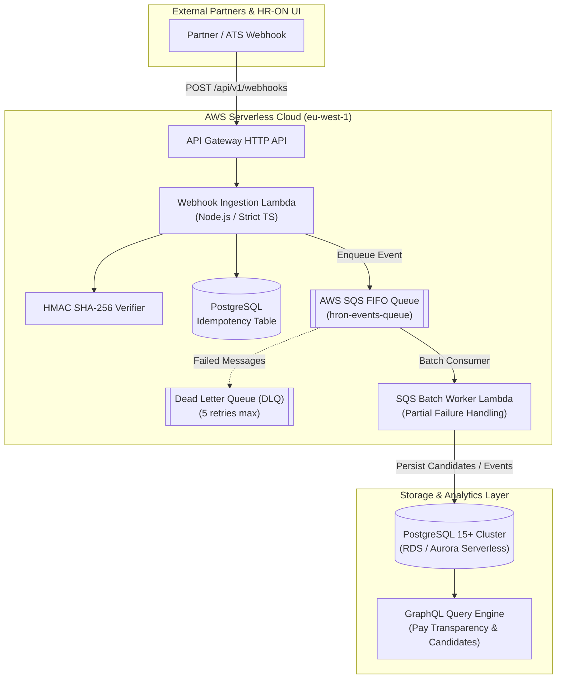

# HR-ON Serverless Event Ingestion & Integration Engine

> **Proof-of-Concept & Architectural Showcase** created specifically for **HR-ON** (Senior Software Engineer role).  
> **Author:** Abd Alrhman Talaat Alshaar Dit Darra (Odense, Denmark)  
> **Tech Stack:** Node.js 20, Strict TypeScript, AWS Lambda, SQS, PostgreSQL, GraphQL, Vitest, GitLab CI.

---

## 🏗️ 1. Architecture Overview

This service demonstrates an enterprise-grade, event-driven serverless architecture designed to ingest high-velocity applicant and employee lifecycle events, validate webhooks with cryptographic HMAC signatures, prevent duplicate processing via idempotency caching, and compute **EU Pay Transparency Directive (2023/970)** compliance metrics.



---

## ⚡ 2. Core Architectural Decisions

### A. Idempotency & At-Least-Once Delivery Prevention
- Webhooks from external systems are notoriously prone to network retries and duplicate transmissions.
- Each event is verified against an `idempotency_key` stored in PostgreSQL with a SHA-256 payload hash and a 24-hour expiration window.
- Duplicate transmissions are acknowledged with HTTP 200 `DUPLICATE_IGNORED`, preventing redundant database operations or duplicate notifications.

### B. Relational Connection Pooling in Serverless
- **The Problem:** Serverless Lambdas scale horizontally on spikes. Opening a direct database connection per invocation quickly exhausts PostgreSQL's connection limit (`max_connections`).
- **The Solution:** The database client implements connection pooling with a low concurrency cap (`max: 5`) and quick idle timeouts (`10,000ms`). In AWS production, this connects through **AWS RDS Proxy** or **PgBouncer** to pool database transactions seamlessly.

### C. SQS Partial Batch Failure Resilience
- Instead of failing an entire batch of SQS records when a single record is malformed, `sqsWorkerLambda.ts` implements AWS Lambda's `batchItemFailures` contract.
- Successful records are committed and deleted from the queue; only the failed record ID is reported back for exponential retry or DLQ quarantine.

### D. EU Pay Transparency Directive (Directive 2023/970) Engine
- Implements automated median salary calculations comparing male and female salary distributions per department.
- When the unadjusted gender pay gap exceeds **5.0%** (and is not justified by objective criteria), the system automatically flags the category as requiring a mandatory **Joint Pay Assessment** as required by EU law.

---

## 🗄️ 3. Database Schema (`migrations/001_init_hron_schema.sql`)

The schema models:
- `hron_job_openings`: Position listings, departments, salary bands, and statuses.
- `hron_candidates`: Applicant pipeline with staged status enums (`RECEIVED`, `SCREENING`, `INTERVIEW`, `OFFER`, `HIRED`).
- `hron_webhook_idempotency`: Security ledger preventing duplicate webhook processing.
- `hron_pay_transparency_metrics`: Audit trail calculating compliance against the 5% EU threshold.
- `mv_hron_job_pipeline_summary`: Materialized view pre-aggregating pipeline metrics for sub-millisecond dashboard queries.

---

## 📦 4. Directory Structure

```text
projects/hr-on-integration-engine/
├── .gitlab-ci.yml                # GitLab CI pipeline configuration
├── .github/workflows/ci.yml      # GitHub Actions CI workflow
├── package.json                  # Dependencies & scripts
├── tsconfig.json                 # Strict TypeScript configuration
├── migrations/
│   └── 001_init_hron_schema.sql  # Production PostgreSQL DDL
├── src/
│   ├── index.ts                  # Local demo execution bootstrap
│   ├── domain/
│   │   ├── models.ts             # Zod schemas & TypeScript types
│   │   └── result.ts             # Functional Result<T, E> error handling
│   ├── handlers/
│   │   ├── webhookLambda.ts      # API Gateway Webhook Lambda
│   │   ├── sqsWorkerLambda.ts    # SQS Batch Consumer Worker Lambda
│   │   └── graphqlHandler.ts     # GraphQL schema & resolvers
│   ├── infrastructure/
│   │   ├── db.ts                 # PostgreSQL serverless connection pool
│   │   └── hmac.ts               # Cryptographic SHA-256 HMAC verifier
│   └── services/
│       └── payTransparencyService.ts # EU Pay Transparency calculation engine
└── tests/
    ├── hmac.test.ts              # Unit tests for cryptographic signatures
    └── payTransparency.test.ts   # Unit tests for EU compliance calculations
```

---

## 🚀 5. Getting Started & Running Locally

```bash
# 1. Install dependencies
npm install

# 2. Type-check with strict TypeScript
npm run typecheck

# 3. Run automated tests
npm test

# 4. Run the local demo (Pay Transparency & GraphQL execution)
npm start
```

---

## 👨‍💻 Candidate Contact
- **Abd Alrhman Talaat Alshaar Dit Darra**
- Odense, Denmark (Local resident, permanent work authorization, 0 days notice)
- Phone / WhatsApp: `+45 42 22 31 10`
- Email: `abdalrhmanaldarra@gmail.com`
- Portfolio: [https://portfolio-abdal-2026.vercel.app](https://portfolio-abdal-2026.vercel.app)
- Recruiter Dossier: [https://portfolio-abdal-2026.vercel.app/hiring](https://portfolio-abdal-2026.vercel.app/hiring)
